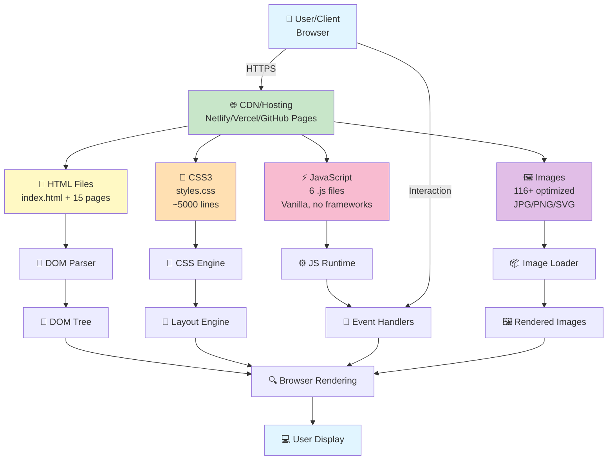
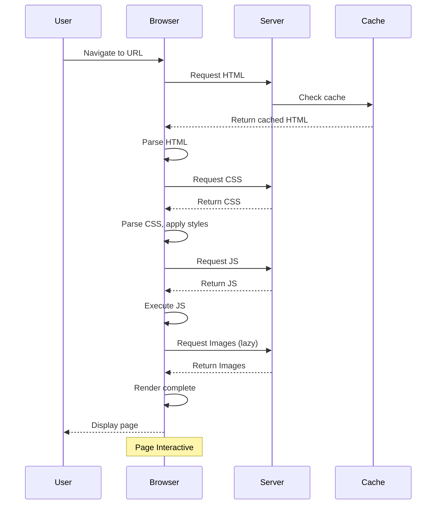
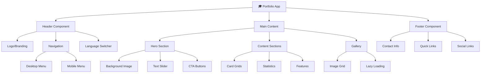
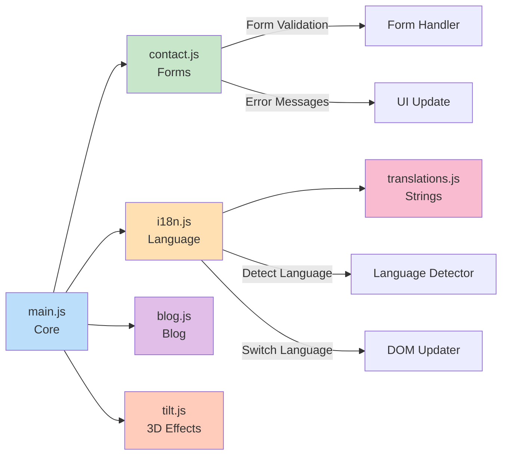
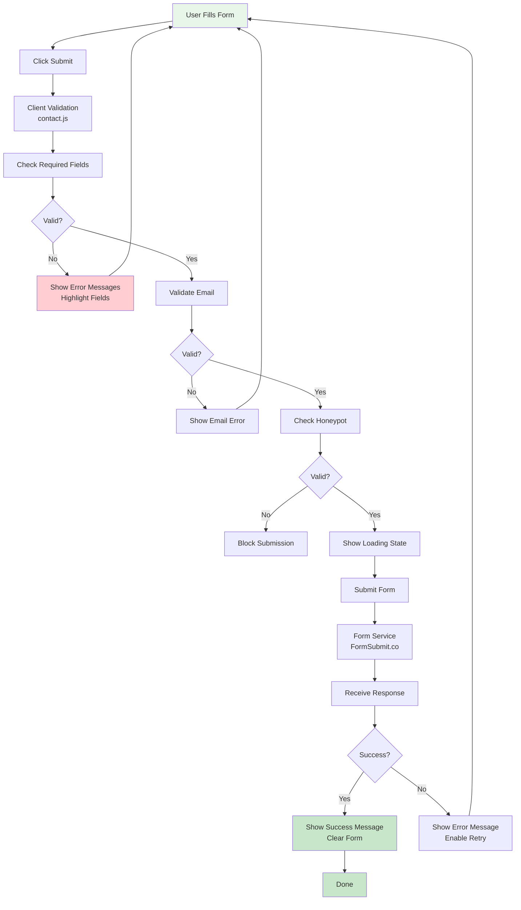
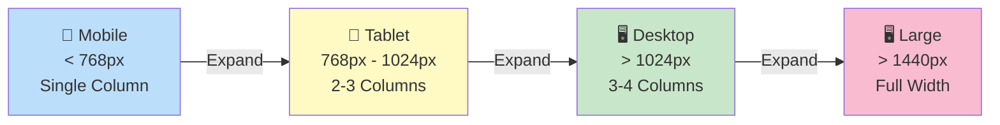

# System Architecture Diagram

## Architecture Overview

---

## Page Load Flow

---

## Component Hierarchy

---

## JavaScript Module Dependencies

---

## Data Flow - Form Submission

---

## Responsive Layout Breakpoints

---

**Last Updated**: June 1, 2026  
**Format**: Mermaid Diagrams
